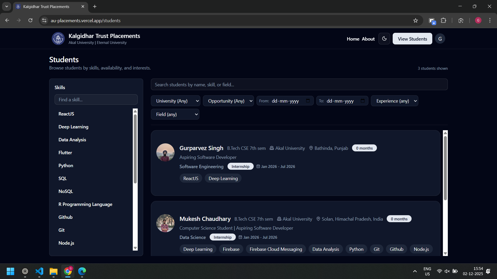
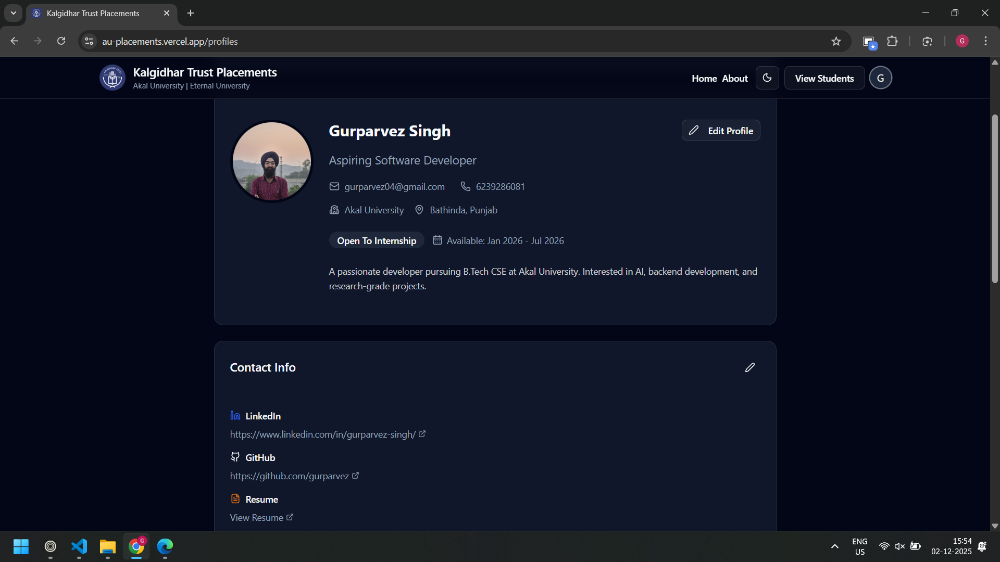
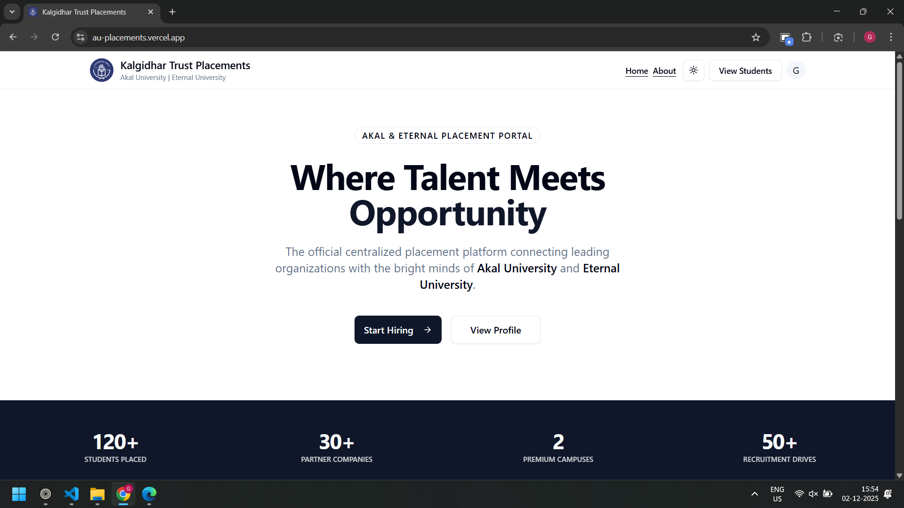

# AU & Eternal Placement Portal

A centralized recruitment and placement platform designed for **Akal University** and **Eternal University**. This platform bridges the gap between students and recruiters by offering unified profiles, advanced filtering, and AI-powered identity verification.

-----

## 🚀 Key Features

### 🔐 AI-Powered Identity Verification

  * **Automated Verification:** Integrates **Google Gemini 1.5 Flash** to perform OCR and semantic analysis on uploaded Student ID cards.
  * **Smart Matching:** Automatically extracts University Name (handling variations like "Baru Sahib" vs "Eternal University") and Student IDs (AUID vs Roll No).
  * **Fraud Prevention:** Cross-references extracted data with user inputs to ensure only valid students can register.

### 🎓 Student Features

  * **Dual-University Support:** Seamlessly handles students from both Akal University and Eternal University.
  * **Comprehensive Profiles:** Students can showcase skills, education, experience, and projects.
  * **Availability Status:** Students can toggle "Open to Work" status with specific date ranges for Internships or Full-time roles.
  * **Resume & Portfolio:** Integration with **Cloudinary** for secure document and image hosting.

### 🔍 Recruitment & Filtering

  * **Advanced Search:** Recruiters can filter candidates by:
      * **Skills** (e.g., React, Python)
      * **Availability** (Date ranges)
      * **Opportunity Type** (Internship vs Job)
      * **University** (Akal vs Eternal)
  * **One-Click Outreach:** Integrated `mailto` templates allowing recruiters to contact students instantly with pre-filled context.

-----

## 🛠️ Tech Stack

### Frontend

  * **Framework:** React (Vite) + TypeScript
  * **State Management:** Redux Toolkit
  * **UI Library:** Shadcn/UI + Tailwind CSS
  * **Icons:** Lucide React
  * **Routing:** React Router DOM

### Backend

  * **Runtime:** Node.js
  * **Framework:** Express.js
  * **Database:** MongoDB (Mongoose)
  * **Authentication:** JWT (HttpOnly Cookies) + Role-Based Access Control (RBAC)

### Services & Tools

  * **AI/LLM:** Google Gemini API (Generative AI SDK)
  * **Storage:** Cloudinary (Images/PDFs)
  * **Validation:** Zod (Frontend) / Mongoose (Backend)

-----

## 🏗️ Architecture & Workflow

### 1\. The Verification Flow

1.  User uploads ID Card image during registration.
2.  Image is passed to Google Gemini with a specialized prompt.
3.  Gemini extracts the **University Name** (converting to Title Case) and **ID Number**.
4.  Backend compares extracted data against user form inputs.
5.  If verified, the user is created in MongoDB with `verified: true`.

### 2\. The Data Flow

  * **Frontend:** Fetches data via Redux Thunks.
  * **Backend:** Controller-Service architecture.
  * **Security:** Passwords hashed with `bcrypt`, sensitive routes protected via `verifyJWT` middleware.

-----

## ⚙️ Setup (If want to run locally)

### Prerequisites

  * Node.js (v18+)
  * MongoDB Instance
  * Cloudinary Account
  * Google Gemini API Key

### 1\. Clone the Repository

Frontend:
```bash
git clone https://github.com/yourusername/au_placements.git
cd au_placements
```

Backend:
```bash
git clone https://github.com/gurparvez/au_placements_backend.git
cd au_placements_backend
```

### 2\. Backend Setup

```bash
npm install

# Create a .env file in /server
PORT=5000
MONGO_URI=your_mongodb_connection_string
ACCESS_TOKEN_SECRET=your_jwt_secret
ACCESS_TOKEN_EXPIRY=1d
CLOUDINARY_CLOUD_NAME=your_cloud_name
CLOUDINARY_API_KEY=your_api_key
CLOUDINARY_API_SECRET=your_api_secret
GEMINI_API_KEY=your_gemini_api_key

# Run Server
npm run dev
```

### 3\. Frontend Setup

```bash
npm install
npm run dev
```

-----

## 📸 Screenshots


Home Page


Students Page


Logged In User Profile


Light Theme

-----

## 🤝 Contributing

Contributions are welcome\! Please follow these steps:

1.  Fork the project.
2.  Create your feature branch (`git checkout -b feature/AmazingFeature`).
3.  Commit your changes (`git commit -m 'Add some AmazingFeature'`).
4.  Push to the branch (`git push origin feature/AmazingFeature`).
5.  Open a Pull Request.

-----

## 📄 License

This project is licensed under the MIT License.

-----

**Developed by [Gurparvez Singh](https://github.com/gurparvez) & [Mukesh Chaudhary](https://github.com/Mukesh032003)**